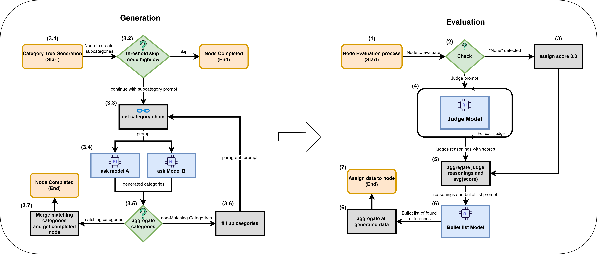
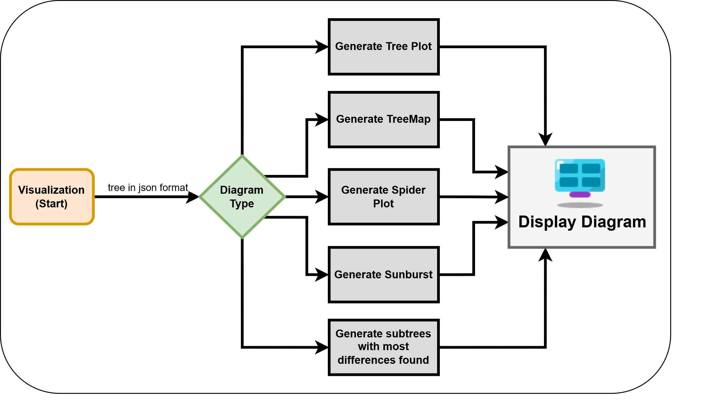
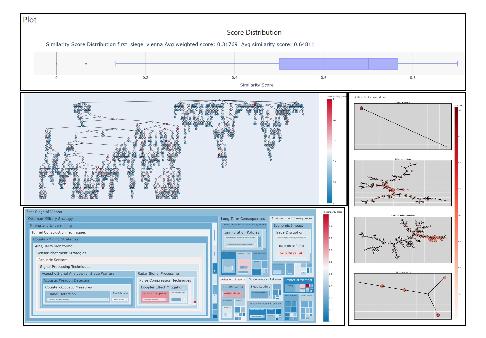
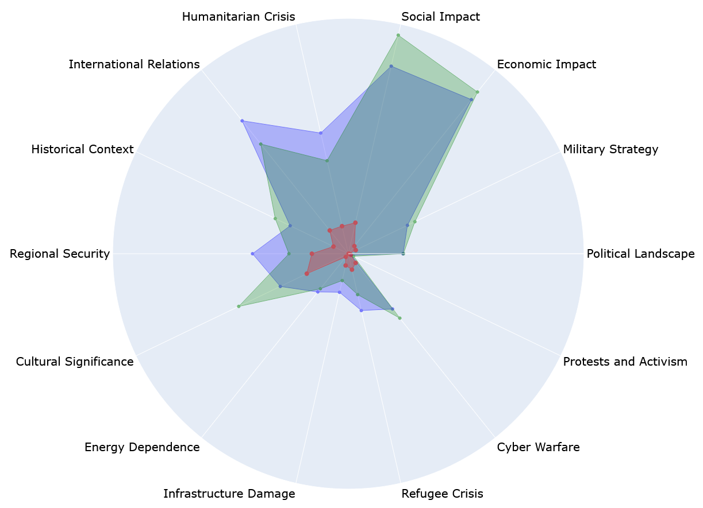

<div align="center">
   
</div>

# 🔥 CALLM: A Framework for Systematic Contrastive Analysis of Large Language Models 🔥

_**CALLM** is a tool which enhances our understanding of architectural and training differences between compared LLMs. Our work contributes to the development of more transparent machine learning models and is meant to foster research in model evaluation and comparative analysis. Also it helps finding ideal model for specific knowledge use cases by inspecting the differences found._


## 🔍 Table of Contents
- [Key Features](#key-features)
- [How to Use It](#how-to-use-it)
- [Main Loop](#main-loop)
- [Evaluation](#evaluation)
  - [Setup](#setup)
  - [Interface](#interface)
  - [Visualization Types](#visualization-types)
- [Citation](#citation)


## ✨ Key Features

- **Automated Hierarchical Topic Generation**: The system dynamically creates a hierarchical topic structure based on user queries.
- **LLM-based Text Comparison**: Uses LLM as a judge technique to find differences between the two model responses.
- **Analysis**: Designed to reveal knowledge differences and performance properties of llms.
- **Visualization**: Outputs can be visualized in multiple formats:
  - [Tree structure](#tree-visualization)
  - [Treemap](#treemap-visualization)
  - [Sunburst diagram](#sunburst-visualization)
  - [Subtree view](#subtree-visualization)
  - [Spider diagram](#spider-visualization)

## 🔧 How to Use It
For running experiments you need to provide your API key. To use the visualization tool you just need to follow the [evaluation section](#evaluation).

Watch our [Demo Video](https://youtu.be/7Dlh_E3WkRw) on YouTube!

## Main Loop (coming soon)
1. **Setting Up Models**: Provide two machine learning models trained on different time periods.
2. **Defining the Query**: Specify a root keyword for the topic of interest (e.g., "social media").
3. **Configuring Parameters**:
   - Choose the depth of the hierarchy.
   - Define thresholds for detecting differences.
4. **Running the Algorithm**: The system will generate hierarchical categories and compare text outputs from the two models.


<div align="center">
   
</div>

## Visualization

### 🚀 Setup
In CALLM folder:

- `json/`: Holds all generated experiments which can be inspected
- `plots/`: Holds all generated plots with the UI
- `spider/`: Holds all spider diagrams generated with the UI

### Interface
To start the UI:

1. `pip install -r requirements.txt`
2. `cd frontend && python3 app.py`

The visualization process enables generation of a variaty of plots as shown below:

<div align="center">
   
</div>


### Visualization Types
- **Distribution Analysis**: Shows general informations about the tree.
- **Tree Visualization**: The hierarchical tree view provides a clear overview of the topic structure:
- **Treemap Visualization**: Treemaps offer an area-based representation of the data hierarchy to find relevant clusters.
- **Subtree Visualization**: Focused view on the most relevant paths in the tree with most differences. This plots uses a depth depending weighted appraoch.

<div align="center">
  
</div>

- **Spider Diagram**: Shows the prefered directions of each model. (Example is from gpt3.5 (green) vs gemini-flash (blue) to category Ukraine)

<div align="center">
  
</div>


**Interactive Features**: All visualizations are interactive - clicking on any node or element displays detailed information about that component.

## Citation
### Bibtex
```bibtex
